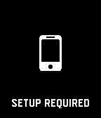

# Loading Screen [](https://travis-ci.org/smallstoneapps/loading-screen/)&nbsp;[](https://www.npmjs.com/package/@smallstoneapps/loading-screen)&nbsp;[](./LICENSE)

A Pebble library for displaying loading / setup screens in your app.

## Installation

*You must be using Pebble SDK 3.12 or newer to use this library.*

To install the package to your app, use the pebble tool:

```
pebble package install @smallstoneapps/loading-screen
```

## Usage

```c
#include <@smallstoneapps/loading-screen/loading-screen.h>

// Must be called once before any other calls
loading_screen_init();

// Pushes the loading screen onto the window stack
loading_screen_show();

// Removes the loading screen from the window stack
loading_screen_hide();
```

## Screenshots

### Loading Screen


### Setup Screen



